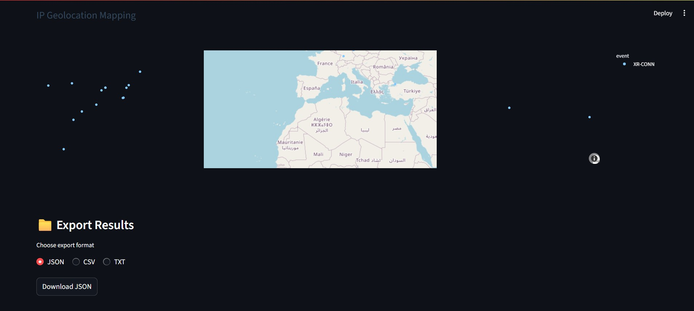

# 🔍 Forensic Artifact Parser and Analyzer for Custom Logs

A web-based forensic tool for parsing and analyzing custom log files. Built using **Streamlit**, this application enables investigators, cybersecurity analysts, and IT professionals to visually explore and detect anomalies in logs with minimal setup.

---

## 🧰 Key Features

### 📂 Multi-format Log Input

* Accepts `.txt`, `.log`, and `.vlog` formats.
* Automatically extracts:

  * Timestamps
  * Event types (`EVNT:XR-XXXX`)
  * Usernames (`usr:username`)Here is your **rewritten README** with slight changes throughout, while keeping **all content and meaning intact**. You can replace your README.md with this version:

---

# 🔍 Log Analysis Tool for Forensic Artifacts

This is a lightweight **web application** built with **Streamlit** to parse and analyse custom log files for forensic and cybersecurity purposes. It empowers investigators, analysts, and IT teams to explore logs visually and detect suspicious activity effortlessly.

---

## 🧰 Main Features

### 📂 Supports Multiple Log Formats

* Compatible with `.txt`, `.log`, and `.vlog` files.
* Automatically identifies and extracts:

  * Timestamps
  * Event identifiers (`EVNT:XR-XXXX`)
  * Usernames (`usr:username`)
  * IP addresses (`IP:xxx.xxx.xxx.xxx`)
  * File paths
  * Process IDs

### 📊 Visual Dashboards & Insights

* **📋 Summary View**: Displays total entries, distinct users, events, and IPs.
* **📅 Event Timeline**: Graphs event frequencies at 10-second intervals for trend analysis.
* **⚠️ Anomaly Detection**:

  * Statistical outlier detection using **Z-Score**.
  * Machine learning-based anomaly identification via **Isolation Forest**.
* **🌍 IP Geolocation Mapping**: Uses `ipinfo.io` to display IP locations on an interactive world map.

### 📤 Data Export Options

* Export parsed results in `.csv`, `.json`, or `.txt` formats for reporting or further investigation.

---

## 🧪 Sample Log Entry Format

Logs should follow this general structure:

```
[ts:1719835600] EVNT:XR-ACCESS usr:john IP:192.168.1.100 =>/home/docs/file1.txt pid4567
```

Parsed fields include:

* `ts` → Epoch timestamp
* `EVNT` → Event type
* `usr` → Username
* `IP` → IP address
* `=>/` → File path
* `pid` → Process ID

---

## 💻 Running Locally

### 🔧 Prerequisites

* Python 3.8 or above
* Required Python libraries (see installation below)

### 📦 Installation

Install dependencies using pip:

```bash
pip install streamlit pandas plotly scikit-learn scipy matplotlib requests
```

### 🚀 Starting the Application

Launch the app with:

```bash
streamlit run app.py
```

Then open the URL shown in your terminal, typically [http://localhost:8501](http://localhost:8501), in your web browser.

---

## 📁 Available Export Formats

Parsed data can be saved as:

* **JSON**
* **CSV**
* **Plain Text (TXT)**

Ideal for archiving, reporting, or importing into additional forensic workflows.

---

## 📌 What You Gain

This application helps you:

* Quickly understand user or system activity.
* Detect potentially malicious or abnormal behavior early.
* Perform fast forensic triage with a simple interface.
* Export clean structured data for in-depth analysis or evidence storage.

---

## 📸 Dashboard Snapshots

### 🔹 **Event Timeline**


### 🔹 **Alerts & Anomalies**


### 🔹 **Geo-location**


---

## 📜 License

Distributed under the [MIT License](LICENSE). Free to use and modify for personal or commercial applications.

---

## 👤 Author

### **Suvetha Raj**

* GitHub: [@suv4tha](https://github.com/suv4tha)
* Email: [suvetha0314@gmail.com](mailto:suvetha0314@gmail.com)

---

Let me know if you need a **brief project summary** for your internship or task submission today.

  * IP addresses (`IP:xxx.xxx.xxx.xxx`)
  * File paths
  * Process IDs

### 📈 Visual & Analytical Dashboards

* **📋 Summary Report**: Overview of log entries, unique users, events, and IPs.
* **📅 Event Timeline**: Time-series visualization of event activity in 10-second intervals.
* **⚠️ Anomaly Detection**:

  * **Z-Score**-based statistical outlier detection.
  * **Isolation Forest** ML-based anomaly identification.
* **🌍 IP Geo-location**: Maps IP addresses using `ipinfo.io` to show locations on an interactive world map.

### 📤 Export Options

* Download parsed data in `.csv`, `.json`, or `.txt`.

---

## 🧪 Example Log Entry Format

Each log entry should follow this general structure:

```
[ts:1719835600] EVNT:XR-ACCESS usr:john IP:192.168.1.100 =>/home/docs/file1.txt pid4567
```

Fields recognized:

* `ts` → Epoch timestamp
* `EVNT` → Event type
* `usr` → Username
* `IP` → Source IP
* `=>/` → File path
* `pid` → Process ID

---

## 💻 Run Locally

### 🔧 Requirements

* Python 3.8+
* Dependencies (see below)

### 📦 Installation

```bash
pip install streamlit pandas plotly scikit-learn scipy matplotlib requests
```

### 🚀 Launch the App

```bash
streamlit run app.py
```

Then open the displayed local URL (usually [http://localhost:8501](http://localhost:8501)) in your browser.

---

## 📁 Export Formats

You can export the parsed log data in multiple formats:

* **JSON**
* **CSV**
* **Plain Text (TXT)**

Perfect for downstream reporting, archiving, or feeding into other forensic tools.

---

## 📌 Outcome

This tool provides:

* Quick visibility into system or user activity.
* Early detection of suspicious behavior.
* Simple interface for forensic triage of logs.
* Exportable, clean structured data for deeper analysis.

---

## 📸 Sample Dashboard

### 🔹 **Event Timeline**


### 🔹 **Alerts & Anomalies**


### 🔹 **Geo-location**



## 📜 License

[MIT License](LICENSE) – free to use and modify for personal or commercial use.

---

## 👨‍💻 Author

### **Suvetha Oudearadjou**

- GitHub: [@suv4tha](https://github.com/suv4tha)
- Email: [suvetha0314@gmail.com](mailto:suvetha0314@gmail.com)

